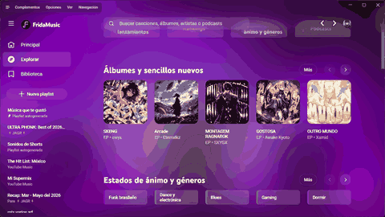
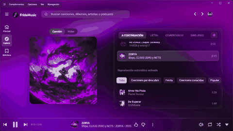

<div align="center">

# 🎧 FridaMusic Desktop

**FridaMusic en Windows, macOS y Linux — por Frida Labs**

[](https://github.com/jagrdev-MX/FridaMusic-Desktop-Releases/releases)
[](#licencia-y-cr%C3%A9ditos)
[](https://github.com/jagrdev-MX/FridaMusic_OF)

[⬇️ Descargar Desktop](https://github.com/jagrdev-MX/FridaMusic-Desktop-Releases/releases) ·
[📱 FridaMusic Android](https://github.com/jagrdev-MX/FridaMusic_OF) ·
[▶ Google Play](https://play.google.com/store/apps/details?id=com.jagr.fridamusic) ·
[🌐 Sitio oficial](https://frida-music-of.vercel.app/)

</div>

---

## Qué es FridaMusic Desktop

**FridaMusic Desktop** lleva la experiencia de FridaMusic al escritorio con una aplicación nativa empaquetada con **Electron**. Está orientada a reproducción, descubrimiento, biblioteca, playlists, letras, cola, personalización visual, integraciones de escritorio y actualizaciones integradas.

El cliente Desktop forma parte del mismo ecosistema de **Frida Labs** que la aplicación Android, pero no es un port 1:1 del código Kotlin. La interfaz y el shell de escritorio se construyen con tecnologías web y Electron, mientras que los flujos de producto, criterios de experiencia e integraciones de FridaMusic se han reutilizado o adaptado donde tiene sentido.

> Como estimación interna de alcance —no como porcentaje de líneas de código copiadas— alrededor del **80 % de los conceptos de servicio, flujos de datos e integración de la experiencia FridaMusic** pudieron reaprovecharse o adaptarse para Desktop. La capa de presentación, integración con el sistema operativo, empaquetado y actualización se implementa específicamente para escritorio.

## Vista rápida

<table>
  <tr>
    <td align="center" width="50%">
      <strong>Explorar y descubrir</strong><br />
      
    </td>
    <td align="center" width="50%">
      <strong>Reproductor y cola</strong><br />
      
    </td>
  </tr>
</table>

## Qué ofrece

- 🎵 **Reproducción de escritorio** con controles persistentes, cola y navegación integrada.
- 🔎 **Exploración y búsqueda** de canciones, álbumes, artistas, playlists y contenido compatible.
- 📚 **Biblioteca y playlists** desde una interfaz adaptada a pantallas grandes.
- 📝 **Letras mejoradas** mediante las extensiones e integraciones incluidas en el proyecto.
- 🎨 **Personalización visual** con temas, CSS y una experiencia dinámica basada en el contenido reproducido.
- 🔌 **Sistema de complementos e integraciones** heredado y adaptado del ecosistema técnico sobre el que se construye Desktop.
- 🔄 **Actualizador integrado** con `electron-updater`, descarga de nuevas versiones, progreso y reinicio para instalar.
- 🖥️ **Integración con el sistema operativo**, incluidos atajos, controles multimedia e integraciones específicas cuando la plataforma las admite.
- 📦 **Distribución multiplataforma** para Windows, macOS y Linux.

## Tecnología

La aplicación de escritorio se desarrolla sobre una base web moderna empaquetada como aplicación nativa:

| Área | Tecnología / función |
| --- | --- |
| Runtime de escritorio | **Electron 42** |
| Lenguajes principales | **TypeScript, JavaScript, HTML y CSS** |
| UI y componentes | **SolidJS**, `solid-element`, `solid-styled-components` |
| Build frontend | **electron-vite / Vite** |
| Tooling | **Node.js**, **pnpm**, TypeScript |
| Empaquetado | **electron-builder** |
| Actualizaciones | **electron-updater** |
| Pruebas | **Playwright** |
| Multimedia | Howler, FFmpeg WebAssembly y utilidades de audio del proyecto |
| Red / servicios | `youtubei.js`, WebSocket y módulos de integración incluidos |
| Escritorio | Discord RPC, MPRIS en Linux y utilidades Electron específicas |
| Privacidad / navegación | Bloqueo integrado basado en Ghostery Adblocker para Electron |

La configuración pública de distribución actual genera paquetes para **x64 y ARM64** cuando el formato lo admite.

## Descargas

Las builds oficiales se publican exclusivamente en este repositorio:

### Windows
- Instalador offline **NSIS**.
- Arquitecturas: **x64** y **ARM64**.
- El actualizador utiliza los metadatos y blockmaps publicados en Releases.

### macOS
- **DMG** y **ZIP**.
- **Intel x64** y **Apple Silicon ARM64**.
- Las builds actuales pueden distribuirse sin firma/notarización; consulta las notas de cada release.

### Linux
- **AppImage**
- **DEB**
- **RPM**
- **tar.gz**
- Builds **x64** y **ARM64** cuando corresponda.

➡️ **[Ver todas las releases de FridaMusic Desktop](https://github.com/jagrdev-MX/FridaMusic-Desktop-Releases/releases)**

## Ecosistema FridaMusic

FridaMusic Desktop y FridaMusic para Android son dos clientes del mismo ecosistema de Frida Labs:

| Proyecto | Plataforma | Enlace |
| --- | --- | --- |
| **FridaMusic** | Android | [Repositorio público](https://github.com/jagrdev-MX/FridaMusic_OF) |
| **FridaMusic en Google Play** | Android | [Google Play](https://play.google.com/store/apps/details?id=com.jagr.fridamusic) |
| **FridaMusic Desktop** | Windows · macOS · Linux | [Releases oficiales](https://github.com/jagrdev-MX/FridaMusic-Desktop-Releases/releases) |
| **Sitio oficial** | Web | [frida-music-of.vercel.app](https://frida-music-of.vercel.app/) |

El desarrollo de Desktop se realiza de forma separada. Este repositorio público está dedicado a **distribución**, metadatos de actualización, notas de versión y snapshots de código fuente correspondientes a las builds publicadas.

## Actualizaciones

FridaMusic Desktop consulta este repositorio público para buscar nuevas versiones mediante `electron-updater`. Cuando existe una actualización, la aplicación puede mostrar la nueva versión, descargarla bajo petición, enseñar el progreso y reiniciar para instalarla.

Los archivos `latest*.yml`, `.blockmap` y los ZIP auxiliares forman parte de la infraestructura del actualizador y no deben confundirse con los instaladores destinados al usuario.

## Código fuente correspondiente

FridaMusic Desktop se distribuye bajo **GPL-3.0**. Cada release binaria debe acompañarse de un archivo:

```text
FridaMusic-Desktop-Source-VERSION.tar.gz
```

Ese archivo contiene el snapshot de código correspondiente a la build distribuida, junto con los submódulos fijados y los avisos aplicables. Los archivos automáticos **“Source code”** que GitHub genera para este repositorio de distribución no sustituyen ese snapshot.

## Seguridad en Windows

Las builds actuales pueden distribuirse sin firma digital Authenticode. Por ello, Microsoft Defender SmartScreen puede mostrar una advertencia de reputación para ejecutables nuevos o poco prevalentes. Una advertencia de reputación no implica por sí sola que el archivo contenga malware.

Descarga FridaMusic Desktop únicamente desde las **[releases oficiales](https://github.com/jagrdev-MX/FridaMusic-Desktop-Releases/releases)**.

## Privacidad y soporte

FridaMusic Desktop funciona principalmente de forma local y Frida Labs no utiliza actualmente un sistema propio de telemetría o analytics para recopilar información de uso de la aplicación. Algunas funciones se conectan a servicios externos necesarios para ofrecer sus capacidades y quedan sujetas a las políticas de esos servicios.

- 📱 [FridaMusic Android](https://github.com/jagrdev-MX/FridaMusic_OF)
- 🌐 [Sitio oficial](https://frida-music-of.vercel.app/)
- 💬 Soporte: [fridalabs.soporte@gmail.com](mailto:fridalabs.soporte@gmail.com)

## Licencia y créditos

FridaMusic Desktop deriva de **Glassy Music** y conserva las obligaciones y atribuciones aplicables de **GPL-3.0**. Glassy Music, a su vez, se apoya en trabajo open source previo, incluido **Pear Desktop**, además de proyectos e integraciones como Better Lyrics y otros componentes con sus propias licencias.

Los snapshots de código fuente distribuidos con cada release conservan los archivos de licencia, avisos y créditos pertinentes.

---

<p align="center">
  <strong>FridaMusic Desktop</strong> · Frida Labs<br />
  Tu música, ahora también en el escritorio.
</p>
